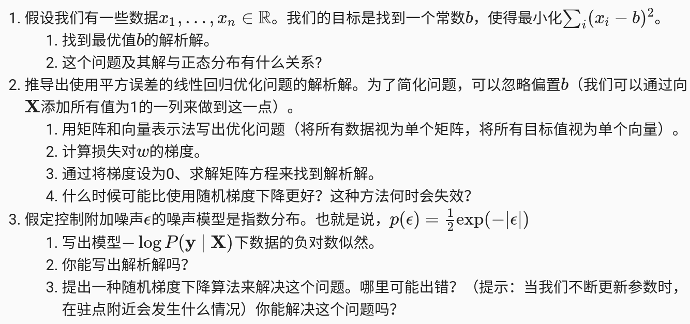

> 网页上查看时，由于github不支持公式显示，所以以下公式不能正常显示，建议下载下来使用typora打开查看！

# 作业以及实验结果

## 3.1 线性回归

**解 1.1**
$$
L(b) = \sum_i(x_i-b)^2 \tag{1}
$$
上式(1)是一个关于$b$的二次方程，要想使得$L(b)$取得最小值，直接对(1)式求导去导数为零对应的$b$即为最优解。
$$
L^{'}(b) = 2 \sum_i(x_i -b) \\
=> \sum_i (x_i -b) = 0 \\
=> b = \frac{1}{n}\sum_ix_i
$$
**解 1.2**

假设$x$是带有高斯噪声的数据，那我们要做的就是在这一堆有噪声的数据中找到一个参数$b$使得如下条件概率取得最大值.对于某一次观测有：
$$
P(b|x) = \frac{1}{\sqrt{2 \pi \sigma^2}}\exp{(-\frac{1}{2\sigma^2}(b-x)^2)}  \tag{2}
$$
则根据最大似然估计，将所有的观测均一起考虑：
$$
P(b|X) = \prod_{i=1}^n p(b|x^{i}) \tag{3}
$$
对(3)式取负对数，则：
$$
-logP(b|X) = \sum_{i=1}^n \frac{1}{2}\log(2\pi\sigma^2) + \frac{1}{2\sigma^2}(b-x^{(i)})^2  \tag{4}
$$
因此问题就变成了最小化(4)式，也就是最小化：
$$
\min \sum_{i=1}^n \frac{1}{2\sigma^2}(b-x^{(i)})^2 \tag{5}
$$
最小化(5)式的方法已在解1.1中进行了推导。

**解 2**

对于线性回归问题，其损失函数如下：
$$
L(w,b) = \frac{1}{n}\sum_{i=1}^nl^{(i)}(w,b) = \frac{1}{n}\sum_{i=1}^n \frac{1}{2}(w^Tx^{(i)}+b-y^{(i)}) \tag{6}
$$

> 对应于公式 3.1.6

为了方便将求和写成矩阵的形式：
$$
L(w,b) = \frac{1}{2n} \|XW - Y\|^2 \tag{7} = \frac{1}{2n}(XW-Y)^T(XW-Y)
$$

> （7）式是问题1的解法

等式(7)显然是一个凸函数，所以必然存在最小值，且极值点就是最小值点。对(7)式求导，并计算导数为零点对应的$W$：
$$
L^{'}(w,b) = \frac{1}{2n}(2X^TXW - 2X^TY) = 0 \\
=> W^* =(X^TX)^{-1}X^TY \tag{8}
$$

> 上式就是一些关于矩阵求导的应用，如果过程不熟悉，可以百度一下，我就不一一罗列了，哈哈！
>
> （8）式的第一个等式就是$w$组成的矩阵的梯度，第二个等式就是方程的解析解。

通过上面的过程可以发现，对于线性回归问题，由于系统模型是线性的，所以最终可以变成一个凸优化问题，必然有解析解。但是该解析解有一些前提，一个是$X^TX$矩阵必须可逆，否则失效。但是在实际的应用中，我们的测量值一般都是远多余系统未知数的个数，也就是构建的矩阵$X$大概率都是秩大于$W$中未知数的个数的。此时应用解析解必然在速度和精度上都优于随机梯度下降。

**解 3**

由于噪声噪声服从$p(\epsilon) = \frac{1}{2}\exp(-|\epsilon|)$，所以对于某一次测量可以建模如下：
$$
P(y|x) = \frac{1}{2}\exp({-|y-w^Tx-b|}) \tag{9}
$$
根据最大似然估计，考虑所有测量将得到如下：
$$
P(y|X) = \prod_{i=1}^n p(y^{i}|x^{i}) \tag{10}
$$
对（10）式取负对数：
$$
-\log{P(y|X)} = \sum_{i=1}^n \log{2}+|y^{(i)}-w^Tx^{(i)} -b| \tag{11}
$$

> 上式（11）便是负对数似然

上式也是可以写出解析解的，当绝对值函数等于0的时候就可以求出最小值，所以可以通过这个结论找到最小值点。考虑某一个测量：
$$
y^{(i)}-w^Tx^{(i)} -b = 0 \tag{12}
$$
如果要考虑所有的观测结果，那么就又变成了最小二乘问题，只需要将（12）写成矩阵的形式，然后求最小二乘解，就可以得到$w$的解析解。

如果采用梯度下降的方法，则会出现在驻点处不可导的问题，解决这个问题也不难，由于上式绝对值函数由两个线性函数组成，所以在任何一个线性函数求导的时候导数一定朝着一个方向变化，如果当导数发生符号变化的时候就说明从一个函数变化到另一个函数了，此时对应的解就接近最优解。

## 3.2 线性回归从零开始实现

该算法实际就是线性拟合，只要写出代价函数，以及模型，基本上问题就能很容易求解。但是需要注意在pytorch中对于需要求解参数，需要将其设置`requires_grad=True`.

另外需要留心训练的过程，训练的过程的思路是：首先选择一个batch size的数据量，输入网络进行传播，然后反向传播计算梯度，根据学习率对参数进行更新，将所有数据遍历完算一次epoch。

**实验结果**

**Q1:** 将权重初始化为零，探讨算法是否任然有效？

> epoch 1, loss 0.031964
> epoch 2, loss 0.000110
> epoch 3, loss 0.000049
> w的估计值: tensor([[ 2.0005], [-3.3997]]), w的真实值：tensor([ 2.0000, -3.4000])
> b的估计值: tensor([4.1995], requires_grad=True), b的真实值：4.2

很明显，初始化为零，算法依然有效。从数学角度来说，由于线性回归的代价函数是凸函数，所以极小值就是最小值。

**Q2:** 尝试使用不同的学习率，观察损失函数值下降的快慢?

> lr = 3
> epoch 1, loss inf
> epoch 2, loss nan
> epoch 3, loss nan
>
> lr = 0.03
> epoch 1, loss 0.035299
> epoch 2, loss 0.000137
> epoch 3, loss 0.000051
>
> lr = 0.003
> epoch 1, loss 9.030750
> epoch 2, loss 4.996935
> epoch 3, loss 2.768051

结论：合适的学习率对代价函数的下降起到非常重要的作用。

